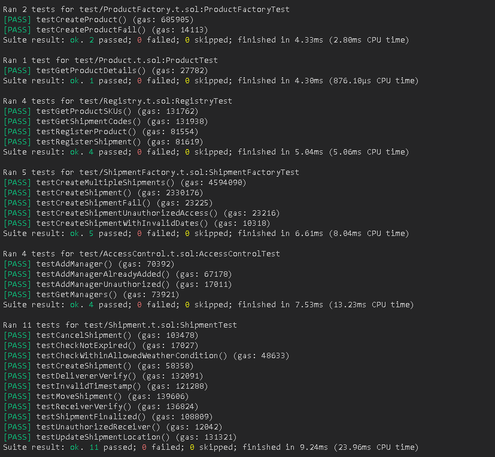
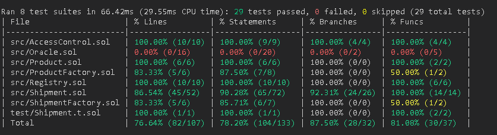

## Documentation

We use Foundry and Forge to develop our project. Detailed usage can be found below.

## Contracts

- (Weather) Oracle : 0x71d5f126bb92368c89b0469aa3d967db14ff18d8
- Registry : 0x97202d6077445d2bBDb494f25AEA21C8D5d81f0b
- ProductFactory : 0x4396B646812D390ecd5E1Ef10baE75f2767B86d8
- ShipmentFactory : 0x12794500025955d645a78f639CdF02CFDDFeb5cE

- Example Product (Egg) : 0xA8c84D8F79F28acB57D5f869FBc88b5c61703790
- Example Shipment (Egg) : 0x43c26B15aeaE9e9c1F679d8e0C413C9e7aB86adE

## Usage

If you are using Remix, delete the remappings.txt file so that Oracle.sol compiles correctly.

If you are using VSCode, when open terminal use Git Bash terminal to run the below commands.

### Download Foundry

```shell
$ curl -L https://foundry.paradigm.xyz | bash
$ source ~/.bashrc
$ foundryup
```

### (Already downloaded) before usage

```shell
$ source ~/.bashrc
```

### Build

```shell
$ forge build
```

### Test

```shell
$ forge test
```

### Format

```shell
$ forge fmt
```

### Run Script

```shell
$ forge script script/<SCRIPT_NAME> --fork-url <SEPOLIA_TESTNET_LINK> --broadcast --via-ir
```

## Test Coverage

Oracle.sol and the Oracle contract cannot be tested in general because it requires a deployed contract on the main Sepolia testnet with LINK tokens (required for Chainlink) in its balance.

### All unit tests



### Coverage



## Run local UI

```shell
Create a .env file in the root directory and add the following line:
ETH_RPC_URL=<SEPOLIA_TESTNET_LINK>
PRIVATE_KEY=<YOUR_PRIVATE_KEY>
WEATHER_ORACLE_ADDRESS=0x71d5f126bb92368c89b0469aa3d967db14ff18d8
REGISTRY_ADDRESS=0x97202d6077445d2bBDb494f25AEA21C8D5d81f0b
PRODUCT_FACTORY_ADDRESS=0x4396B646812D390ecd5E1Ef10baE75f2767B86d8
SHIPMENT_FACTORY_ADDRESS=0x12794500025955d645a78f639CdF02CFDDFeb5cE

# Example contract addresses
EXAMPLE_PRODUCT_ADDRESS=0xA8c84D8F79F28acB57D5f869FBc88b5c61703790
EXAMPLE_SHIPMENT_ADDRESS=0x43c26B15aeaE9e9c1F679d8e0C413C9e7aB86adE

$ pip install python-dotenv
$ pip install web3
$ pip install PyQt5
$ python3 script.py
```
