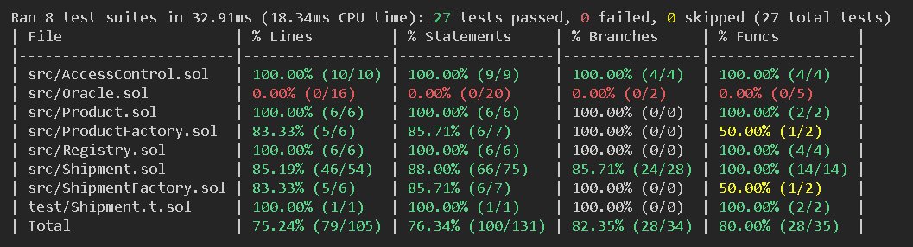

## Documentation

We use Foundry and Forge to develop our project. Detailed usage can be found below.

## Contracts
- (Weather) Oracle: 0x71d5f126bb92368c89b0469aa3d967db14ff18d8
- Registry: 0x0057e6e38c4720ad121eda1220f9db3ed314511b
- ProductFactory: 0xfbc9dcf337278bf941031821aeae62ce9af620dc
- ShipmentFactory: 0xbaa363a60589f41a2ed41a8ed3210f4eef90010d

## Usage

If you are using Remix, delete the remappings.txt file so that Oracle.sol compiles correctly.

If you are using VSCode, when open terminal use Git Bash terminal to run the below commands.

### Download Foundry
```shell
$ curl -L https://foundry.paradigm.xyz | bash
$ source ~/.bashrc 
$ foundryup
```

### (Already downloaded) before usage
```shell
$ source ~/.bashrc 
```

### Build

```shell
$ forge build
```

### Test

```shell
$ forge test
```

### Format

```shell
$ forge fmt
```

### Run Script

```shell
$ forge script script/<SCRIPT_NAME> --fork-url <SEPOLIA_TESTNET_LINK> --broadcast --via-ir
```

## Test Coverage

Oracle.sol and the Oracle contract cannot be tested in general because it requires a deployed contract on the main Sepolia testnet with LINK tokens (required for Chainlink) in its balance.

### All unit tests


### Coverage

